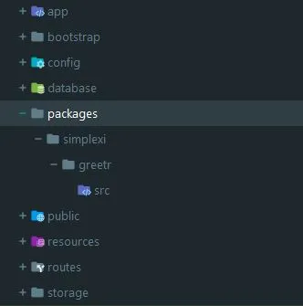
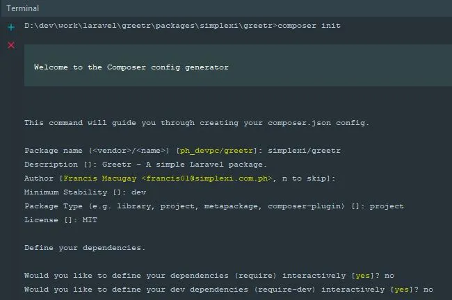
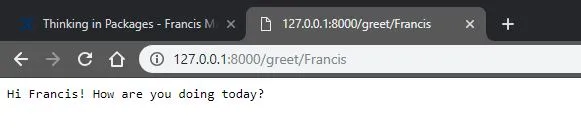
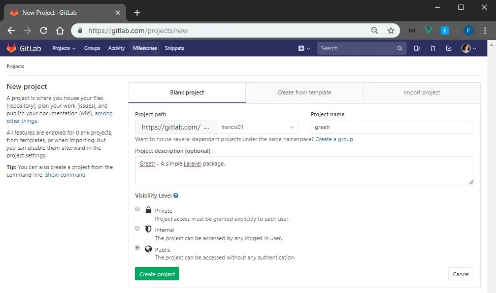

**Creating Laravel Packages**

###### Prerequisites

Before we can start creating our package, it is expected that you already have Composer and Git installed on your system. It is also required that you can create a remote repository to any VCS service like GitLab, GitHub or Bitbucket. For this tech blog, we are going to use GitLab and Laravel 5.8.

###### Create a new Laravel project

The package we are creating is called “greetr” that just displays a greeting message when called. We are going to use Composer in the command line to create our Laravel project.

`$ composer create-project — prefer-dist laravel/laravel greetr`

###### File Structure

On the default folder structure of a new Laravel project, create a file structure as shown below to house our package development.

Note that inside the packages folder should be the vendor name simplexi followed by the package name greetr. The src folder will contain all of our package source code. In some instances, you may also create a dist branch if you are compiling your assets for a production server. In this way, developers that will be using your package will have an option to choose between the source files in the src folder or the distribution files in the dist folder when installing your package through Composer.

Package composer.json

In your command prompt, navigate to `packages/simplexi/greetr` directory. Then we will need to initialize this folder as a composer package by running the following command:

`$ composer init`

This command will ask you for some info regarding your package. You can accept the defaults by pressing enter and edit composer.json file that will be created later.

After the initialization, we can edit the `composer.json` file as follows.

<pre>
{
    "name": "simplexi/greetr",
    "description": "Greetr - A simple Laravel package.",
    "type": "project",
    "license": "MIT",
    "authors": [
        {
            "name": "Francis Macugay",
            "email": "francis01@simplexi.com.ph"
        }
    ],
    "minimum-stability": "dev",
    "autoload": {
        "psr-4": {
            "Simplexi\\Greetr\\": "src/"
        }
    },
    "require": {}
}
</pre>

The only thing added here and that should be noted is the autoload object property. This will automatically load your package with the given namespace `Simplexi\Greetr`. You may also include any package dependencies in the `require` property. To learn more about `composer.json` file schema, click here.

Note that the `composer.json` in your project is different from the `composer.json` in your package. Be sure you are editing the correct `composer.json` file.

Project composer.json

Autoload the namespace for your package by adding the line `"Simplexi\\Greetr\\": “packages/simplexi/greetr/src"` inside the `autoload->psr-4` property of your project `composer.json` file. With this, your package classes inside the `src` folder will be autoloaded and available for our project to use.

<pre>
"autoload": {
    "psr-4": {
        "App\\": "app/",
        "Simplexi\\Greetr\\": "packages/simplexi/greetr/src"
    },
    "classmap": [
        "database/seeds",
        "database/factories"
    ]
},
</pre>

There are other options for package discovery which you can reference here. Now, since we’ve edited our project’s `composer.json` file, we should reload it by running the following command in the project root directory:

`$ composer dump-autoload`

###### Greetr.php Class

Create the _Greetr.php class_ inside the src folder as follows.

<pre>
namespace Simplexi\Greetr;
class Greetr
{
    public function greet(String $sName)
    {
        return 'Hi ' . $sName . '! How are you doing today?';
    }
}
</pre>

We should indicate a namespace for this class which should be the same namespace that you indicated in the project `composer.json` file for it to be autoloaded. In our case, following namespace convention in Laravel, it should be `Simplexi\Greetr`.

Of course, it is a good idea to follow the same project structure as the Laravel project. But in this tech blog, we are just showing a simple greeting in the browser. Keep in mind that as your package grows, it is good practice to keep publicly available functionalities in one or two service classes. All other classes should not be available outside the package. In this way, your package should be manageable independently from other packages or from the main project.

                                . . .

**Testing Our Package**

Our simple package is now ready for testing. But first, let’s create a route and call our package Greetr class from this route for now.

<pre>
use Simplexi\Greetr\Greetr;

Route::get('/greet/{name}', function($sName) {
    $oGreetr = new Greetr();
    return $oGreetr->greet($sName);
});
</pre>

We can import our _Greetr_ class from our package by specifying its namespace first with the use keyword. Then we can instantiate the class and call its member functions in our project’s route file.

Run an out of the box development server from Laravel by running the following command in your project root directory:

`$ php artisan serve`
 
`Laravel development server started: <http://127.0.0.1:8000>`

Open your browser and enter the following URL: http://127.0.0.1:8000/greetr/Francis

                                . . .

**Publishing Packages to GitLab**

###### Creating GitLab repository

First, we should create a new project in GitLab. Make sure the visibility level is set to public. We may also set it to private if we want control over who can use our package. Doing this will require additional steps. But for this tech blog’s purposes, we will set it as public.

Navigate to our package directory `packages/simplexi/greetr`. Initialize git, commit changes, and tag changeset with semantic versioning by running the following commands.

<pre>
// packages/simplexi/greetr$ git init
$ git checkout -b master
$ git add .
$ git commit -m "initial commit"
$ git tag 1.0.0
</pre>

###### Push local source code to remote GitLab server

Make sure your account is already setup on your local machine for us to push our source code to the GitLab server. We only need to push the `packages/simplexi/greetr` directory to GitLab. It is advisable to include files like `CHANGELOG.md` and `readme.md` for other developers to know more about your package.

To push our local source code to the newly created GitLab project, run the following commands. Make sure to replace the origin URL with your own remote repository URL.

<pre>
// packages/simplexi/greetr$ git remote add origin https://gitlab.com/francis01/greetr.git
$ git push -u origin --all
$ git push -u origin --tags
</pre>

Now, we are all set. Other developers may install our package to their own projects to speed up their development time. In the next section, we will try to import our package in a new Laravel project.

                                . . .

**Importing Laravel Package**

We can now import our package from the GitLab server into a new Laravel project using _Composer_. Create another Laravel project on your local machine.

###### Require our package in composer.json

Edit the new project’s `composer.json` file to require our package and also indicate our repository in GitLab for Composer to know where to fetch packages aside from the default packagist repositories.

<pre>
...
"require": {
    "php": "^7.1.3",
    "fideloper/proxy": "^4.0",
    "laravel/framework": "5.7.*",
    "laravel/tinker": "^1.0",
    "simplexi/greetr": "^1.0.0"
},
...
"repositories": [
    {
        "type": "vcs",
        "url": "https://gitlab.com/francis01/greetr"
    }
]
...
</pre>

The repository’s property lists all non-packagist repositories. If you are going to install several packages from the same GitLab domain, instead of specifying each package’s repository you may use the type “composer” and only indicate the domain in the URL. However, there’s an additional setup that your GitLab admin should do in this case. For now, let’s stick to a single repository with type “vcs”.

Run the following command to load the changes we made to our project’s `composer.json` file and install our package.

`$ composer update`

We now should find our package in the vendor directory of our project. We should be able to use our package like any other packages that we require in our project. We can test our package by just following the previous section on testing our package but this time do it on the new Laravel project that you just created.

                                . . .

**Choosing a Package Version**

When other developers are using your package, there will come a time that they will start raising bugs, improvements or suggest new features. You as the maintainer of the package will have to fix that bug and release a new version. Now, all developers using your package will be informed about your fix in your repository documentations.

The thing is, whenever a new version is released, developers will have the option to upgrade to that release if they are affected by the bug or choose not to. This can be done in Composer very easily by just updating your project’s `composer.json` file with the desired version, run `composer update`, run your tests, and redeploy. If the new release doesn’t work, you may rollback to previous versions easily. This is one of those perks of having Composer manage your package dependencies and it's really useful.

We’ve covered just the tip of the icing about Laravel packages in this tech blog. Surely there are a lot more we can do with packages. But for now, you may explore the official documentation on Laravel packages.

**Summary**

Implementing the use of packages in our projects can have a bit of overhead at first when developing new projects. But in the long run, our library codebase can be much more manageable.

This way of sharing packages, in my opinion, also made open sources much more reliable. Thinking in packages makes our daily work as developers much easier especially if there’s a lot of ready-made packages that we can use in our projects. Sharing packages makes our creation live longer and get a chance to be appreciated by others for the efforts we’ve put in it. So yeah, stop reinventing the wheel and start building your packages now!
